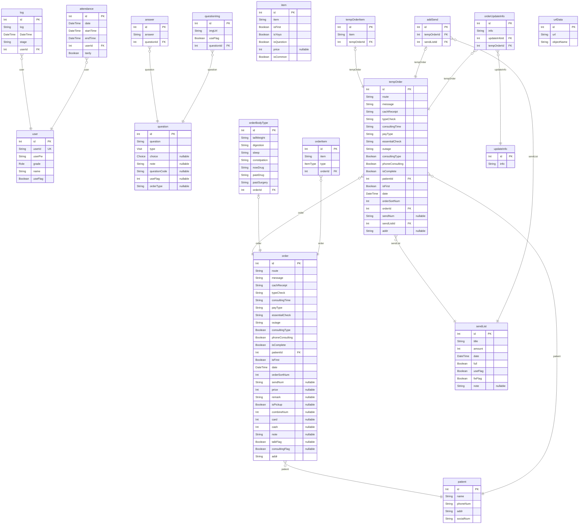

# 한의원
> Generated by [`prisma-markdown`](https://github.com/samchon/prisma-markdown)

- [default](#default)

## default

### `user`

**Properties**
  - `id`: index key
  - `userId`: 유저 아이디
  - `userPw`: 유저 비밀번호
  - `grade`: 유저 등급
  - `name`: 유저 이름
  - `useFlag`: 사용 여부

### `log`

**Properties**
  - `id`: index key
  - `log`: 로그
  - `DateTime`: 시간
  - `stage`: 과정
  - `userId`: 유저 key

### `attendance`

**Properties**
  - `id`: index key
  - `date`: 출근 날짜
  - `startTime`: 출근 시간
  - `endTime`: 퇴근 시간
  - `userId`: 유저 key
  - `tardy`: 지각 여부

### `question`

**Properties**
  - `id`: index key
  - `question`: 질문 내용
  - `type`: 초진 or 재진 타입 
  - `choice`: 선택형 or 서술형 or 멀티 선택형 
  - `note`: 비고
  - `questionCode`: 어떤 질문인지 코드 값(order table에 매칭)
  - `useFlag`: 사용여부
  - `orderType`: 어떤 질문인지 타입 (주문관련, 주문 아이템, 환자 정보 등)

### `answer`

**Properties**
  - `id`: index key
  - `answer`: 선택지
  - `questionId`: question key 값

### `questionImg`

**Properties**
  - `id`: index key
  - `imgUrl`: 이미지 url 값
  - `useFlag`: 사용 여부 flag
  - `questionId`: question key 값

### `patient`

**Properties**
  - `id`: index key
  - `name`: 환자 이름
  - `phoneNum`: 환자 핸드폰 번호
  - `addr`: 환자 주소
  - `socialNum`: 환자 주민번호

### `item`

**Properties**
  - `id`: index key
  - `item`: 아이템 정보
  - `isFirst`: 초진 or 재진 여부
  - `isYoyo`: 요요 여부
  - `isQuestion`: 설문 관련 정보 여부
  - `price`: 가격(택배비 제외)
  - `isCommon`: 

### `order`

**Properties**
  - `id`: index key
  - `route`: 알게 된 경로 
  - `message`: 배송 요청 메세지
  - `cachReceipt`: 현금 영수증
  - `typeCheck`: 비대면 진료 타입 해당사항 체크
  - `consultingTime`: 상담가능시간
  - `payType`: 결제 진행 방법
  - `essentialCheck`: 필수 체크
  - `outage`: 감량 된 킬로수
  - `consultingType`: 유선 상담 유무 -> true면 유선
  - `phoneConsulting`: 유선 상담 완료 플래그
  - `isComplete`: 결제 완료 유무 -> 완료 시 발송목록으로
  - `patientId`: 환자 key 
  - `isFirst`: 초진 재진 유무
  - `date`: 접수 일자
  - `orderSortNum`: 정렬 번호
  - `sendNum`: 송장 번호
  - `price`: 오더에 주문된 제품 총 가격
  - `remark`: 특이 사항
  - `isPickup`: 방문 수령 여부 true: 방문 수령, false: 택배 배송
  - `combineNum`: 합배송 번호
  - `card`: 해당 오더에 카드로 결제된 금액
  - `cash`: 해당 오더에 계좌 이체 된 금액
  - `note`: 
  - `talkFlag`: 접수 알림톡 발송 여부
  - `consultingFlag`: 상담 연결 여부
  - `addr`: 

### `tempOrder`

**Properties**
  - `id`: index key
  - `route`: 알게 된 경로 
  - `message`: 배송 요청 메세지
  - `cachReceipt`: 현금 영수증
  - `typeCheck`: 비대면 진료 타입 해당사항 체크
  - `consultingTime`: 상담가능시간
  - `payType`: 결제 진행 방법
  - `essentialCheck`: 필수 체크
  - `outage`: 감량 된 킬로수
  - `consultingType`: 유선 상담 유무 -> true면 유선
  - `phoneConsulting`: 유선 상담 완료 플래그
  - `isComplete`: 결제 완료 유무 -> 완료 시 발송목록으로
  - `patientId`: 환자 key
  - `isFirst`: 초진 재진 유무
  - `date`: 접수 일자
  - `orderSortNum`: 정렬 번호
  - `orderId`: 원 오더 key
  - `sendNum`: 송장 번호
  - `sendListId`: 발송목록 key
  - `addr`: 

### `tempOrderItem`

**Properties**
  - `id`: index key
  - `item`: 주문한 아이템
  - `tempOrderId`: 해당 temp order key

### `sendList`

**Properties**
  - `id`: index key
  - `title`: 발송목록 타이틀(발송되는 날짜)
  - `amount`: 발송 총량
  - `date`: 만들어진 날짜
  - `full`: 기준 총량을 채웠는지 여부(최대 350개)
  - `useFlag`: 사용 여부
  - `fixFlag`: 고정 여부
  - `note`: 비고 - 안씀

### `addSend`

**Properties**
  - `id`: index key
  - `tempOrderId`: 다른 날로 발송 추가 되는 오더
  - `sendListId`: 해당 sendList 키

### `orderBodyType`

**Properties**
  - `id`: index key
  - `tallWeight`: 키 몸무게
  - `digestion`: 소화 상태
  - `sleep`: 수면 상태
  - `constipation`: 변비 상태
  - `nowDrug`: 현재 복용 중인 약
  - `pastDrug`: 과거 다이어트 약 복용
  - `pastSurgery`: 과거에 수술하신 경우
  - `orderId`: 해당 주문 오더 key

### `orderItem`

**Properties**
  - `id`: index key
  - `item`: 주문한 아이템
  - `type`: 아이템 타입
  - `orderId`: 해당 주문 오더 key

### `orderUpdateInfo`

**Properties**
  - `id`: index key
  - `info`: 업데이트 정보
  - `updateInfoId`: 업데이트 정보 아이디
  - `tempOrderId`: temp order key

### `updateInfo`

**Properties**
  - `id`: index key
  - `info`: 업데이트 정보

### `urlData`

**Properties**
  - `id`: index key
  - `url`: url
  - `objectName`: object 이름