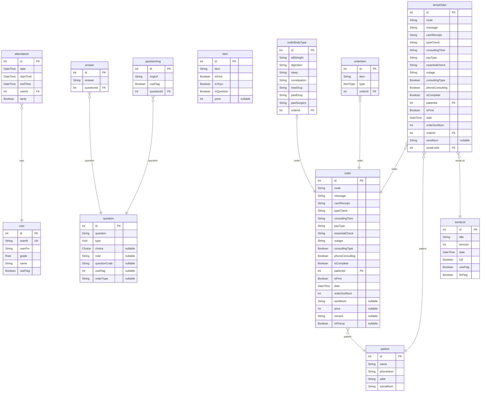

# 한의원
> Generated by [`prisma-markdown`](https://github.com/samchon/prisma-markdown)

- [default](#default)

## default

### `user`

**Properties**
  - `id`: 
  - `userId`: 
  - `userPw`: 
  - `grade`: 
  - `name`: 
  - `useFlag`: 

### `attendance`

**Properties**
  - `id`: 
  - `date`: 
  - `startTime`: 
  - `endTime`: 
  - `userId`: 
  - `tardy`: 

### `question`

**Properties**
  - `id`: 
  - `question`: 
  - `type`: 
  - `choice`: 
  - `note`: 
  - `questionCode`: 
  - `useFlag`: 
  - `orderType`: 

### `answer`

**Properties**
  - `id`: 
  - `answer`: 
  - `questionId`: 

### `questionImg`

**Properties**
  - `id`: 
  - `imgUrl`: 
  - `useFlag`: 
  - `questionId`: 

### `patient`

**Properties**
  - `id`: 
  - `name`: 
  - `phoneNum`: 
  - `addr`: 
  - `socialNum`: 

### `item`

**Properties**
  - `id`: 
  - `item`: 
  - `isFirst`: 
  - `isYoyo`: 
  - `isQuestion`: 
  - `price`: 

### `order`

**Properties**
  - `id`: 
  - `route`: 
  - `message`: 
  - `cachReceipt`: 
  - `typeCheck`: 
  - `consultingTime`: 
  - `payType`: 
  - `essentialCheck`: 
  - `outage`: 
  - `consultingType`: 
  - `phoneConsulting`: 
  - `isComplete`: 
  - `patientId`: 
  - `isFirst`: 
  - `date`: 
  - `orderSortNum`: 
  - `sendNum`: 
  - `price`: 
  - `remark`: 
  - `isPickup`: 

### `tempOrder`

**Properties**
  - `id`: 
  - `route`: 
  - `message`: 
  - `cachReceipt`: 
  - `typeCheck`: 
  - `consultingTime`: 
  - `payType`: 
  - `essentialCheck`: 
  - `outage`: 
  - `consultingType`: 
  - `phoneConsulting`: 
  - `isComplete`: 
  - `patientId`: 
  - `isFirst`: 
  - `date`: 
  - `orderSortNum`: 
  - `orderId`: 
  - `sendNum`: 
  - `sendListId`: 

### `sendList`

**Properties**
  - `id`: 
  - `title`: 
  - `amount`: 
  - `date`: 
  - `full`: 
  - `useFlag`: 
  - `fixFlag`: 

### `orderBodyType`

**Properties**
  - `id`: 
  - `tallWeight`: 
  - `digestion`: 
  - `sleep`: 
  - `constipation`: 
  - `nowDrug`: 
  - `pastDrug`: 
  - `pastSurgery`: 
  - `orderId`: 

### `orderItem`

**Properties**
  - `id`: 
  - `item`: 
  - `type`: 
  - `orderId`: 