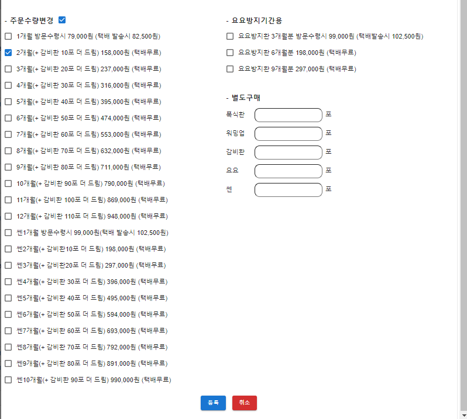
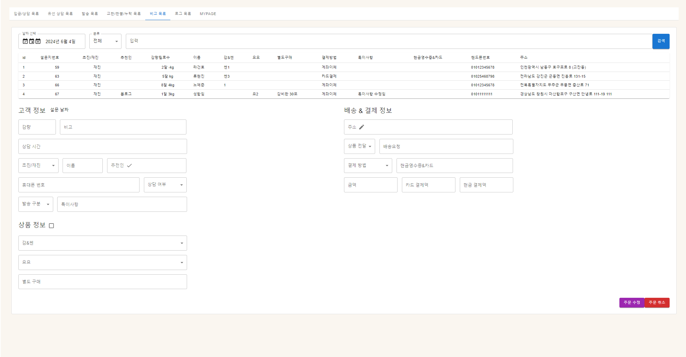

중요부분
계좌 이체 자동처리
발송목록(서비스환)

## 기본적인 업무 플로우

- 환자가 접수 
- 입금상담목록 
- 접수 알림톡 발송 및 상담 시작 
- 유선 상담 원할 시 유선 상담 목록으로 이동 
- 상담 완료 시 결제 안내 
- 계좌 이체 시 일괄 업데이트, 카드 결제 시 결제 완료 처리 
- 발송목록 
- 발송 완료 

## 설문

환자가 주문을 접수할 때 내는 설문. 재진과 초진으로 나눠짐. 재진일 경우 patient 테이블에 환자 데이터(기존 주문 내역)이 있어야 접수가 가능. 초진일 경우 환자의 현재 몸 상태까지 기재.

주소는 검색 기능으로 서치

<h3>외국인 처리는 아직 미정<h3>

접수 후 이름과 핸드폰 번호로 자신의 주문을 조회할 수 있으며 발송목록에 넘어가기 전까지 주문 수정이 가능함

접수 되는데로 해당 주문 내역에 맞는 금액이 정산 되어 order 테이블에 들어가게 됨.

### 택배비 여부
- 감1,쎈1,요1 각각 따로 주문
- 별도 주문 건만 있을 시
- 혹은 감1 + 별도 주문이여도 택배비 부과

택배비는 3500원임

#### 주문 상세 로직

기본적으로 진행되고 있는 주문이 있을 시에는 중복 주문을 하지 못하게 막는 것이 원칙이다

- 초진일 경우 해당 되는 내용을 적고 제출을 누른다
- 해당 환자의 데이터가 기존 patient 테이블에 있는 데이터인지 먼저 확인한다.
- 만약 환자 정보가 있을 시 409를 리턴해서 재진 접수로 안내 한다.(프론트에서)
- 초진이 확인 될 경우 진행 중인 오더가 없으므로 접수를 진행한다.

- 재진일 경우 해당 되는 내용을 적고 제출을 누른다
- 해당 환자의 데이터가 기존 patient 테이블에 있는 데이터인지 먼저 확인한다.
- 만약 환자 정보가 있을 시 404를 리턴해서 초진 접수로 안내 한다.(프론트에서)
- 그 뒤에 현재 진행 중인 오더가 있는지 확인한다. 여기서 오더라함은 발송이 되지 않은 주문을 말한다.
- 만약 진행 중인 오더가 있다면 409를 리턴해서 오더 수정으로 안내 한다. (프론트에서)
- 오더가 없다면 접수를 진행 한다.

## 입금상담목록

설문에서 주문이 접수가 완료 되면 해당 주문을 볼 수 있는 페이지.

상담은 카톡상담과 유선상담으로 나뉜다. 원칙적으로는 유선상담을 해야되나 편의상 기본적으로 카톡 상담이 우선이며 이 페이지에서 새로 접수된 주문을 엑셀(해당 엑셀은 발송톡용 엑셀과 체크용 엑셀 두개의 파일이 다운로드 된다.)로 뽑아 접수 알림톡을 보내 상담을 시작하게 됨. 접수톡을 보낸 뒤 체크용 엑셀을 업로드 하면 알림톡 보낸 주문들을 알림톡을 보냈다고 처리하게 됨.

그리고 상담이 연결되면 고객 정보 옆에 상담연결 버튼을 눌러 상담 완료 됐다고 완료 처리

#### 완료 로직

- 해당 order의 id 값을 서버에서 받아, 기존 발송목록을 조회하여 order의 item 개수와 발송목록의 item 개수를 파악하여 새로 만들지 아니면 기존 발송목록에 넣을지 판단하게 된다. 
- 해당 order의 데이터에 따라 tempOrder 테이블에 temp order 데이터를 생성하게 된다.
- temp order를 만드는 이유는 발송목록에서 order가 수정될 시에도 발송목록에서 순서가 변하지 않도록 조정하는 역할을 하기 위해서이다.
- 따라서 발송목록에서 데이터를 조회할 시에는 무조건 tempOrder 테이블에서 조회하게 된다.

미입금 엑셀은 상담이 어느 정도 진행 된 후에 금액이 일치하지 않아 발송목록으로 넘어가지 않는 인원들을 엑셀로 뽑아냄

상담 미연결은 상담 미연결인 사람들을 엑셀로 뽑아냄

상담은 카톡 상담과 유선 상담이 있으며 기본적으로는 카톡 상담으로 진행 하되 환자가 유선 상담을 원할 시 유선 상담 목록으로 해당 주문을 이동 시킬 수 있음

날짜 별로 조회가 가능하며 해당 주문의 주문 내역이나 발송 주소 등 주문의 정보를 수정할 수 있음

### 결제
상담이 완료 되면 결제 안내
계좌 이체일 경우 계좌 이체 내역을 엑셀로 받아 한번에 결제완료 처리 후 발송목록으로 이동처리. 만약 동명이인이거나 확인이 필요한(주문 내역에 없는 이름 혹은 잘못된 금액) 내역이 있다면 엑셀 파일로 자동으로 다운. (아래 계좌이체 결제 로직 참조)

카드 결제일 경우 업무 상 발송목록에서 입금안내를 하기 때문에 결제가 됐다고 치고 결제완료 버튼을 눌러 발송목록으로 이동시킨다. (즉 기존 카드결제액 + 현금결제액을 주문 금액과 비교하는 로직이 사라짐)

만약 최신 발송목록이 아닌 특정 일자의 발송목록으로 넘기고 싶다면 발송일자를 선택해서 입금 완료 처리를 할 수 있음(다만 발송완료가 되지 않은 발송목록 한정)

#### 신환 엑셀 파일
따로 환자 등록 처리를 해야 되기 때문에 신규 환자에 대한 엑셀 파일을 다운로드
신환엑셀 다운 버튼을 누르면 해당 일자의 초진 접수 환자만 엑셀로 나오게 됨.(해당일자의 신규 환자만 나오는지 확인)

#### 원내 주문 생성
기타 다양한 문제로 원내에서 주문을 생성해야 될 때 간단하게 주문을 생성할 수 있게 하는 기능

버튼 항목에서 주문 생성 버튼을 누르게 되면

해당 팝업창이 뜨게 된다. 여기서 최소한의 환자 정보를 입력하면 새 주문이 생성된다. 그렇게 되면 기타 정보들은 입금상담목록에서 수정하면 된다.

#### 분리배송
분리배송은 환자가 하나의 주문을 두 개의 주소로 분리하고 싶을 때 처리
order 테이블은 그대로 둬야 하는데 챠팅이랑 장부는 원래 오더로 나와야 하기 때문이다.
따라서 (어차피 발송목록은 tempOrder를 가져오므로) tempOrder를 쪼개게 된다. 분리배송은 orderItem을 키 인으로 정의(일반 발송인지 분리배송인지 기존 orderItem은 order 테이블에 묶여 있기 때문). 즉 원래의 order의 주문 내역은 orderItem 테이블에 저장되고 발송 목록 이동시 tempOrder를 생성해 order를 물고 orderItem을 묶어서 가져와 처리를 하지만 분리배송은 따로 tempOrderItem 테이블에 분리 되게 저장하고 거기에 키인된 아이템을 저장하게 된다.

환자가 분리배송을 어떻게 요구할 지 알 수 없으므로 상품은 직접 적어 넣는 걸로 한다. 따라서 식별 가능하게 적어넣어야 한다.

분리 배송은 즉시 tempOrder가 생성되어 발송목록에서 보이게 된다. 하지만 입금처리는 되지 않았으므로 택배비 정산을 확인해 입금상담목록에서 완료처리를 해주어야 한다.

분리배송에서의 택배비의 경우 각각의 분리되는 주문을 기준으로 하여 해당 분리주문(tempOrder)의 발송항목이 택배비를 부과해야 되는 주문이면 택배비를 부과하고 아니면 부과하지 않는다.

예를 들어 감3개월을 감1개월과 감2개월로 나누어 각각 분리배송을 요청 했을 시에 감1개월에 해당 되는 주문에 택배비를 부과 해야한다.

#### 합배송
합배송은 환자 여러 명이 하나의 주소로 배송받고 싶을 때 처리(세 명 이상 합배송 처리 되는지 확인 필요)
합배송은 order 테이블에 combineNum을 추가해서 정렬(합배송 안에서도 정렬이 필요하기 때문)

합배송 시 두 주문을 합쳐 택배비를 받지 않는 조건이 되면 택배비를 둘 다 부과 하지 않고(예를 들어 감1, 감1 주문일 때 합배송 처리하면 감2가 배송되는거나 마찬가지이기 때문에 택배비를 부과하지 않는다) 두 주문을 합쳐도 택배비를 받는 조건이면 금액이 적은 쪽에 택배비를 부과한다. (예를 들면 감1, 별도주문이라면 합쳐도 택배비를 부과하는 주문이나 마찬가지이기 때문에 별도 주문에 택배비를 부과한다)

따라서 발송목록에서 주문이 수정되는 경우 합배송 주문을 살펴보고 택배비가 부과되는지 아닌지 확인해야 한다. 

만약 감2개월 주문과 별도 주문만 들어온 주문을 합배송하면 원래 합배송에선 택배비가 부과되지 않지만 만약 발송목록에서 감2개월 주문을 감1개월로 바꾸게 되면 택배비 부과 조건이 성립하기 때문에 택배비 부과처리가 되어야 한다. 합배송에서는 일차적으로 가격이 적은 쪽으로 택배비가 부과되며, 만약 다른 요구사항이 있을 수 있으므로 (택배비 반반 부담 등) 해당 항목에 대해선 price를 수기로 바꿀 수 있는 기능을 추가한다(수기 추가 기능은 아직 미정)

합배송 버튼을 누르면 나오는 팝업창에 이름을 검색해서 해당 주문과 합배송 처리를 하게 된다.

#### 계좌 이체 엑셀 로직

해당 로직은 util 디렉토리 안 cashExcel.ts에 구현 되어 있음.
계좌 이체 처리는 현재 업무일, 지정된 시간에 원장님이 계좌 이체로 송금된 내역을 엑셀 파일로 전달.
해당 엑셀 파일을 입금상담목록에서 업로드하면 데이터를 json으로 변환하여 비교 시작

나올 수 있는 경우의 수는 다음과 같다.

- 일치해서 완료 처리해야 되는 데이터 (금액과 환자 데이터 모두 일치)
- 엑셀 데이터 중 일치하는게 없는 데이터 (금액과 환자 데이터 하나라도)
- 중복이라 확인이 필요한 경우 (동명이인 등)

먼저 객체를 생성해 필요한 인자를 넘겨준다. 
1. 엑셀 데이터
2. 해당 일자 계좌 이체 데이터
3. 아이템 리스트

compare 함수를 통해 비교 시작

buildHashTable 함수를 이용해서 1번 데이터를 해시테이블로 변환 시킨다.
그 다음 2번 데이터를 순회하면서 검사를 실시한다.
- 2번 데이터(오더 데이터)가 해시 테이블에 이름이 있을 경우
    - 해시테이블 안에 해당 이름을 가진 사람이 한 명 이상이라 금액을 비교해야 되는 경우
        - 금액을 비교해서 금액이 동일한 데이터가 없으면 matches 배열에 삽입
        - hashTable 특성 상 해당 이름을 가진 데이터가 두 개 이상이면 배열로 저장되기 때문에 checkDuplicateFunc으로 중복되는 데이터인지 확인 -> 중복되는 데이터면 해당 해시테이블의 데이터만 splice 후 다시 hashTable에 저장
        -> 중복 데이터가 아니면 해당 해시 테이블 삭제

        - 동명 이인 중 하필 동일 금액이 잇어 수동으로 처리해야되는 경우
        - 중복데이터를 체크하기 위한 checkDuplicate 배열에 해당 데이터를 삽입하고 duplicates 배열에 삽입
        - 중복 데이터 삭제(앞에서 부터 지우면 index로 지우기가 힘들어 reverse 후 삭제)

    - 해시테이블 안에 해당 이름을 가진 사람이 한 명이라 금액만 비교해서 바로 입금 처리하면 되는 경우
        - 금액이 맞으면 matches 배열에 삽입
        - 금액이 틀릴 시 noMathes 배열에 삽입
        - 금액이 맞건 틀리건 동명이인이 없기 때문에 해시테이블에서 해당 이름 제거

    - 위 처리 후 해시테이블에 남아있는 데이터는 주문 데이터랑 일치하지 않는 정보이므로 (입금자 명이 틀리다거나, 금액이 틀리다거나)
      noMatch 배열에 삽입한다.

그 후 일치하는 데이터는 (matches) 바로 입금처리 진행.
noMatch와 duplicates는 각각 엑셀 시트로 만들어 엑셀 파일로 반환

## 유선상담목록

원장님이 상담하는 유선 상담 페이지
유선 상담을 원하는 환자들을 입금상담목록에서 이동 처리
역시 날짜별로 조회 가능(유선상담목록은 전체 조회 기능이 있으면 좋을 듯?)
상품 정보와 환자 정보를 조회할 수 있으며 그걸 토대로 유선 상담 후 상담 완료 시 다시 입금 상담 목록으로 이동 처리

## 방문수령

방문 수령의 경우 주문을 한 뒤에 직접 방문해서 약재를 수령하겠다고 하는 주문을 대상으로 하는 페이지이다.

기본적으로 교환/환불/누락을 제외한 모든 주문은 입금상담목록으로 들어오므로 입금상담목록에서 주문을 선택한 뒤 밑에 방문수령 버튼을 누르면 방문수령 리스트로 이동하게 된다.

방문수령의 경우 결제 방법이 두 가지가 있는데

1. 방문수령을 하러 방문을 한 뒤 데스크에서 결제를 하는 경우 - 이 경우에는 데스크 쪽에서 결제 처리가 되므로 우리 시스템에서는 더 이상 처리할 게 없음

2. 방문수령을 선택했지만 따로 계좌이체를 통해 결제를 진행한 경우 - 이 경우에는 실제 발송은 되지 않지만 장부에는 올라가야 되기 때문에 발송목록으로 이동처리를 해주어야 한다.

## 취소된 상담 목록

취소된 주문이 있는 리스트이다. 주문을 취소하게 되면 데이터가 아예 삭제 되지 않고 해당 리스트로 오게 되는데 이는 주문을 취소한다고 했다가 변덕을 부리는 사람들 때문에 있는 리스트이다. 따라서 해당 주문을 복구할 필요성이 있고 해당 주문을 주문 복구 버튼을 누르면 다시 입금상담목록에 주문으로 데이터가 생성된다.

## 발송목록

해당 주문들을 묶어서 발송을 나가게 할 수 있는 페이지
발송이 나가는 날짜로 조회 가능
최대 350개가 들어 갈 수 있음(주문이 350개가 아닌 주문한 내역 30개. 예를 들면 감1은 1개 감2는 2개 이런 식. 별도 주문은 포함 안됨)
만약 350개를 다 채우면 자동으로 발송목록 고정이 되며 만약에 기존 발송목록에 들어갈 수 없는 주문이 발송처리 되면 새 발송목록을 자동으로 생성하게 됨.
350개를 다 안 채워도 발송목록을 고정할 수 있음

발송목록은 월화목금(발송나가는 요일)로 자동으로 생성되고 (이번주 화요일 발송목록까지 생성 되어 있으면 목요일 발송목록으로 새로 생성) 만약 해당 날짜가 공휴일이나 발송을 하지 못하는 날짜면 발송일자를 수정할 수 있음

### 정렬

발송목록은 순서가 중요함. 해당 정렬 카테고리 별로 나가는 서비스환이 다르기 때문. 다음 순서 대로 정렬하고 색으로 구분함(색 옆에 숫자는 정렬 번호)

#### 정렬 순서

정렬은 다음 순서를 따른다.

교환 -> 누락 -> 방문 -> 감비환 -> 쎈 -> 요요 -> 합배송 -> 분리배송

그리고 감비환,쎈,요요 안에서 개월 수 대로 정렬된 뒤 해당 개월 수 안에서
 
 일반 -> 특이 -> 챌린지 -> 지인 -> 구수방

순으로 정렬된다.

만약 교차주문일 시 (이를테면 감+쎈, 혹은 감+쎈+요 등 주문 내역이 섞인 경우) 감+쎈 같이 쎈이 들어간 주문은 쎈 정렬에서 마지막에 개월 수대로 정렬하고 요요가 들어간 주문은 요요 정렬에서 마지막에 개월 수대로 정렬하게 된다. 

정렬에 기본적으로 기준이 되는 orderSortNum은 다음과 같다.

- 교환(주황 -3) - 주문내역 교환
- 누락(하늘 -2) - 원에서의 실수로 누락된 내역 발송
- 방문(빨강 -1) - 방문 수령(발송이 아닌 방문이지만 발송내역에서 보여야 한다고 함)
- 별도(연두 0) - 별도 주문만 한 오더
- 일반(투명 1) - 일반 주문
- 특이(보라 2) - 폭식환 추가 구매, 서비스 변경, 후기 서비스, 패키지 변경 등
- 챌린지(초록 2) - 인스타에 글 쓴 환자의 주문
- 지인(노랑 4) - 설문지에 지인 쓰고 기존 환자 리스트에서 확인 된 환자
- 구수방(분홍 5) - 설문지에 구수방 써져 있으면 구수방 - 구미수다방/ 구미맘카페/ 구미맘/ 구수방 써져있으면 적용
- 합배송(무지개 6) - 합배송 처리 -> 여기서는 합배송 안에서 무지개 색으로 각각 구분
- 분리배송(7) - 분리배송 처리

만약 발송목록의 발송일자를 수정하고 싶으면 발송일자 수정을 통해 옮길 수 있음

각 주문을 더블클릭하면 수정할 수 있는 팝업이 나온다.

해당 주문을 수정한 뒤 수정내역에 속하는 카테고리를 선택해주어야 한다.(챠팅이나 서비스 환 등 기타 이유 때문)
카테고리를 수정하면 발송목록에서 제일 앞에 있는 두 개의 항목이 초록색으로 수정되며 주문 수정 내역에 수정된 주문수정 카테고리가 나오게 된다.

이는 간호사들이 수정된 항목을 체크하기 위해서인데 두 군데에서 체크가 되어야 한다.

- 데스크 : 데스크에서 챠팅을 하기 때문에 정보가 수정되면 챠트를 수정해야 한다. 따라서 데스크에서 확인하게 되면 확인이 끝났다는 표시로 밑에 버튼 중 수정 체크 버튼을 누르게 되면 두번째 초록색 칠이 없어진다.

- 감비환실 : 감비환실에서는 서비스환을 수정내역에 맞게 넣어줘야 되기 때문에 제일 왼쪽 항목을 초록색으로 칠하게 된다.

주문수량변경 옆 체크 박스를 누르면 모든 오더아이템을 확인할 수 있다.

맨 밑에 취소 버튼을 누르면 주문이 취소되는데 이 역시 주문이 즉시 삭제 되지 않고 발송목록에서 회색으로 흐리게 색칠되면서 disabled 처리가 된다. 이 주문은 나중에 간호사들이 따로 한번에 처리하게 한다.

#### 결제 처리

결제는 총 세가지 경우가 있다.

- 미결제(0)
- 결제(1)
- 재결제 요청(2)

결제가 되어있지 않으면 금액에 빨간색으로 칠해지고 결제가 되면 색이 없어지고 재결제는 주황색으로 칠해진다. 재결제 요청은 결제를 다시 요청 했을 때 확인을 해야되기 때문에 주황색으로 칠해놓는다.

#### 비고 발송 처리 
간혹 발송목록과 발송일자가 다른 일자에 발송이 되도록 요청을 하는 주문이 있어 따로 비고 칸에 적어 넣기로 함.(발송목록에 팝업으로 적는 칸 추가) -> 해당 발송일자에 장부처리 되기는 하지만 발송을 다른 날로 원하는 거임 (수정여부 초록색으로 칠해지는지 확인)

해당 리스트를 그대로 가져와서 송장번호를 뽑는 엑셀 파일을 만들 수 있음. 그걸 송장번호 뽑는 프로그램에 업로드 하면 해당 리스트의 순서에 맞게 송장번호가 나오는 엑셀이 있는데 그걸 다시 업로드 하면 자동으로 송장번호가 업로드 되게 됨.

#### 송장번호 파일

송장번호는 따로 송장번호를 뽑는 프로그램(로젠택배)에 해당 발송목록의 엑셀 파일을 업로드해서 송장번호를 뽑게 된다. 그래서 발송목록에서 발송목록 엑셀 다운로드 버튼을 누르면 해당 발송목록의 엑셀 파일을 다운 받을 수 있고 이 파일을 로젠 프로그램에 업로드하면 해당 주문의 송장번호가 담긴 엑셀 파일을 프로그램에서 받을 수 있다. 그 엑셀 파일을 다시 업로드 하면 자동으로 해당 주문에 맞는 송장번호가 업데이트 된다.

#### 장부출력

장부출력 버튼을 누르면 장부출력됨

#### 차팅용 엑셀

챠팅 엑셀 출력 가능

발송되는 날 아침 발송 알림톡 엑셀을 뽑을 수 있음

발송이 완료되면 발송 완료 버튼 

## 완료된 발송목록 & 교환/환불/누락 목록

완료된 발송목록에서는 이미 발송 완료된 발송목록을 검색 해볼 수 있다. 여기서 해당 주문을 선택한 뒤 select box에서 교환/환불/누락 중 하나를 고르고 교환/환불/누락 처리 버튼을 누르면 해당 주문이 교환/환불/누락 목록에 새 주문으로 생성된다.

환불 데이터는 따로 환불만 해주면 되서 처리할 게 없지만 교환/누락의 경우에는 택배가 발송되야 되므로 입금상담목록에서와 같이 똑같은 프로세스를 거치게 된다.

## 후기 대상 목록

비고 목록은 후기 안내 대상 주문만 볼 수 있는 페이지(몇 달 안에 몇키로 뺀)
후기 안내용

## 로그목록

로그 목록은 로그를 볼 수 있는 페이지이다.
현재 조회 로그까지 조회되나 조회 로그는 빼고 업무처리 로그만 저장할 예정.

## 마이페이지
마이페이지 - 근태기록 조회

## 관리자 페이지
관리자 페이지 - 근태기록 조회, 새 인원 추가, 새 주문 추가 가능
